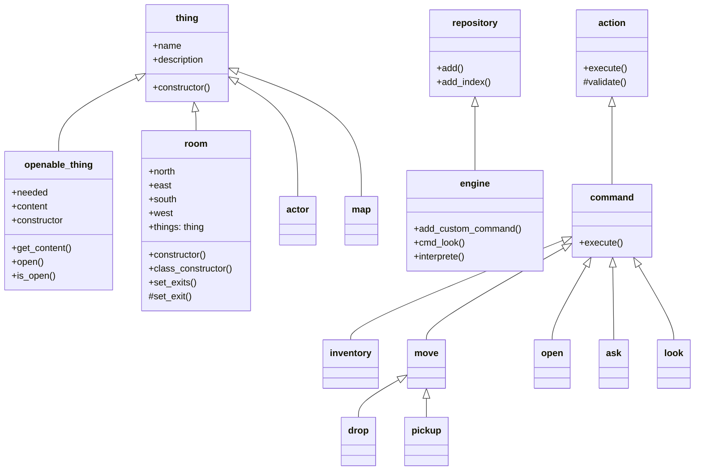

# The Quest ~ Trial of a Wizard's Guild Aspirant


# Game engine
a wizard's adventure game based on a fork of the AXAGE game engine (ABAP teXt Adventure Game Engine) and abap2UI5. 
The game is set in a fantasy world, where the player takes on the role of a wizard's apprentice. The player explores the wizard's house, interacts with various objects and explores. The Quest is work in progress...

The goal of the game is to obtain three magical items: the Orb of Sunlight, the Potion of Infinite Stars, and the Staff of Eternal Moon. These items need to be combined to open a portal to the Wizard’s Guild where the apprentice will finally be recognized as a full wizard.

# maps
define rooms with exits to north, east, south and west, up and down

# actors
define actors 

# things
define things that can be found, pickup (taken) or dropped.

## openable things
create things that can be opened using special things

## implement new operations (commands)
e.g. cast a spell, splash, weld

# parser
use simple syntax (one command, following by zero, one or more parameters) to navigate in the world

## navigation commands
```
N or NORTH        Go to the room on the north side
E or EAST         Go to the room on the east side
S or SOUTH        Go to the room on the south side
W or WEST         Go to the room on the west side
UP                Go to the room upstairs
DOWN              Go to the room downstairs
MAP               show floor plan/game world
```

## Game standard commands
```
INV or INVENTARY  Show everything you carry
LOOK              Look what''s in the room
LOOK <object>     Have a closer look at the object in the room or in your inventory
TAKE <object>     Take object in the room
DROP <object>     Drop an object that you carry

OPEN <object>     Open something that is in the room
ASK <person>      Ask a person to talk to you
```

The MAP command draws a static map, which the player can use for orientation.
With the LOOK command, you can look around and discover things that you might want to examine more closely...

Interaction

In the game, there are "objects". So far, <objects> can carried (TAKE or PICKUP), discarded (DROP), or examined (LOOK <object>). Some objects can also be opened. When an object is opened, other objects may be inside. Those objects found are automatically taken and packed into the inventory (INV command). So, you can always see what objects you are carrying with you.
The adventure then consists of finding all possible objects and applying them correctly.

Actors

Currently, actors (people, monsters, wizards, etc.) can be defined. However, they can only give a response when asked (ASK command). So, they can already give hints..

## Game custom commands
```
SPLASH
WELD

```

# class diagram

https://mermaid-js.github.io/mermaid/#/classDiagram
    


